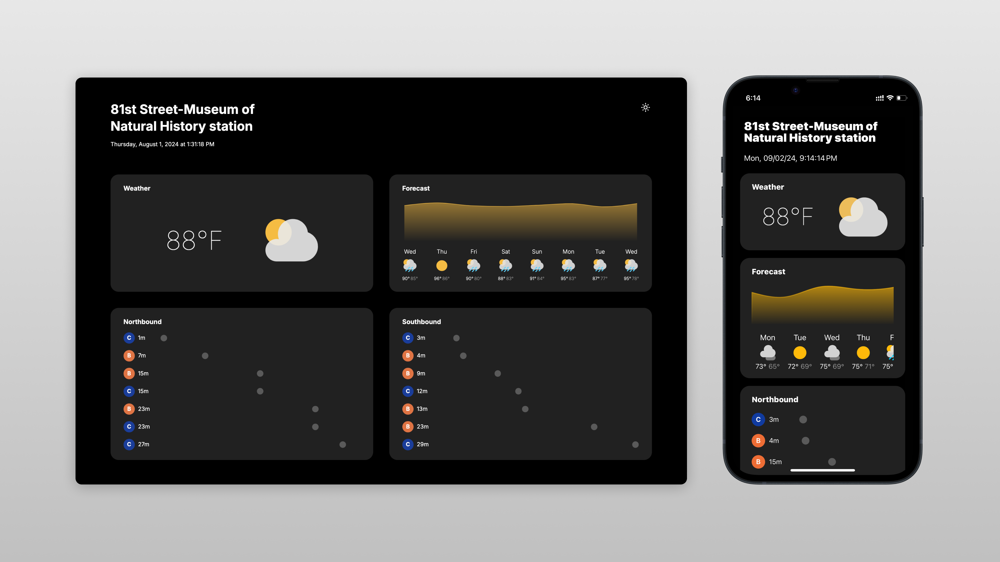

# s81 Real-Time Dashboard



## Tech Stack

- **Frontend:** Next.js, TypeScript, SCSS, Recharts
- **Mobile:** React Native, Expo, TypeScript, react-native-svg
- **Backend:** Golang, Kafka
- **Real-Time:** WebSockets
- **Deployment:** Docker, Docker Compose

## Overview

The s81 Real-Time Dashboard provides live updates for the NYC subway station 81 St-Museum of Natural History, displaying data for subway lines A, B, and C, along with current weather conditions.

## Features

- Real-time subway line data visualization
- Live weather updates
- Responsive and user-friendly UI

## Getting Started

### Prerequisites

- [Node.js](https://nodejs.org/) and [npm](https://www.npmjs.com/)
- [Docker](https://www.docker.com/)
- [Go](https://golang.org/)

### Installation

1. **Clone the repository:**

   ```bash
   git clone https://github.com/yourusername/s81-dashboard.git
   cd s81-dashboard
   ```

2. **Install dependencies:**

   ```bash
   npm install
   ```

3. **Set up environment variables:** 

   Create a `.env` file in the root directory and add necessary environment variables.

4. **Run the application:**

   ```bash
   docker-compose up
   ```

## Usage

- Access the dashboard at `http://localhost:3000`
- Navigate through the interface to view real-time updates

## Contributing

Contributions are welcome! Please fork the repository and use a feature branch. Pull requests are reviewed regularly.

## License

This project is licensed under the MIT License.